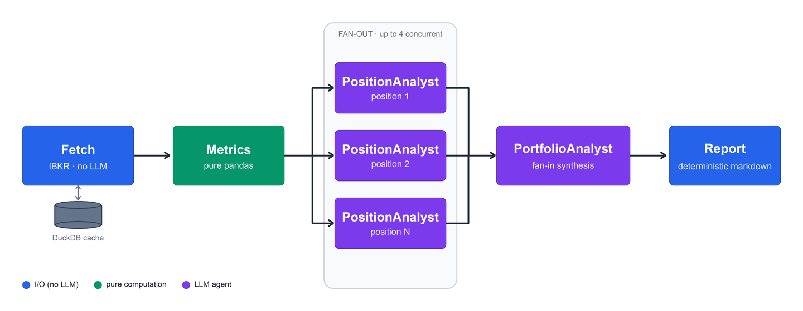

# Portfolio Agents

Experimental agentic pipeline that analyses an equity portfolio using
[Interactive Brokers](https://www.interactivebrokers.com/) (account + market data) and
[OpenAI](https://openai.com/). Inspired by [TradingAgents](https://github.com/TauricResearch/TradingAgents).


## Demo run (w/o IB or OpenAI credentials)

```sh
uv sync
uv run portfolio-agents --demo   # fake IBKR data + fake LLM
```

## Real run

Requires [TWS](https://www.interactivebrokers.com/en/trading/tws.php) or
[IB Gateway](https://www.interactivebrokers.com/en/trading/ibgateway-stable.php) running with API
access enabled (paper account recommended), plus an [OpenAI API key](https://platform.openai.com/).

The IB connection is read-only — the agents analyse, they never trade.

```sh
cp .env.example .env         # fill in OPENAI_API_KEY

uv sync
uv run portfolio-agents      # writes reports/report-NNN.md
```

## Pipeline



1. **Fetch** — account summary, positions, and per-position market data: a year of daily bars plus
   IV/HV (DuckDB-cached, only missing dates are downloaded) and a sentiment snapshot (put/call
   volume, shortable shares).
2. **Metrics** — pure pandas, no I/O: concentration, exposures, and per-position trend/volatility/sentiment numbers.
3. **Position(s)** — one PositionAnalyst per position, four at a time, grounding news, catalysts, and
   analyst sentiment via hosted web search; all claims cite dated sources.
4. **Portfolio** — a tool-free PortfolioAnalyst synthesizes the account snapshot, portfolio metrics,
   and every position assessment into the portfolio view.
5. **Report** — deterministic markdown render; the final report is not an LLM call.
